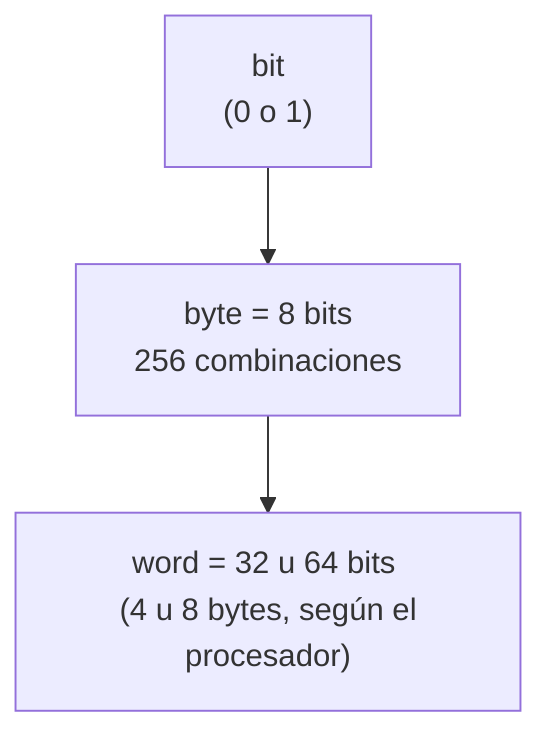

# Introducción al Internet

*Sesión 1 — Analítica de la Web*

---

## 1. Herramientas de Internet

El ecosistema de Internet se apoya en un conjunto amplio de herramientas, agrupables según su propósito:

**Comunicación y colaboración**
- Mail / Correos
- Redes sociales
- Plataformas de trabajo colaborativo, streaming y educativas (*LMS, Zoom, Teams*)
- Telefonía VoIP

**Navegación, búsqueda e información**
- Navegadores
- Buscadores
- Páginas web
- Blogs
- LLM (web)

**Comercio y finanzas**
- E-commerce
- Pasarelas de pago
- Banca móvil

**Otros**
- IoT / AIoT
- Geolocalización (*maps, tracker*)
- Juegos

---

## 2. Historia y evolución del Internet

### 2.1 Orígenes: ARPANET (1969)

En **1969** se crea **ARPANET**, la red precursora de Internet, financiada para conectar proyectos militares, universitarios y científicos.

> **Concepto clave:** Internet es una *red de redes* — computadoras agrupadas en muchas redes independientes que se comunican entre sí mediante mensajes codificados en bytes. Suele representarse como un **grafo**, donde cada nodo es un dispositivo o red y cada arista, una conexión.

### 2.2 El nacimiento de la Web (1991)

En **1991** nace la ***World Wide Web (www)***, junto con dos piezas fundamentales:

- ***HTML*** — el estándar que define cómo se estructuran y comunican los archivos.
- ***HTTP*** — el protocolo (conjunto de reglas) que define cómo se comunican las máquinas entre sí.

### 2.3 De la Web 1.0 a la Web 4.0

| Versión | Característica principal | Rol del usuario |
|---|---|---|
| **Web 1.0** | Estática, de solo lectura | Consume contenido, sin interactuar |
| **Web 2.0** | Interactiva y colaborativa (redes sociales, blogs) | Publica, comenta, comparte |
| **Web 3.0** | Semántica — búsquedas más ordenadas y estructuradas | Recibe resultados más relevantes/organizados |
| **Web 4.0** | Inteligente — impulsada por algoritmos de NLP e IA | Interactúa por voz/lenguaje natural |

**Web 1.0** — flujo unidireccional, el usuario solo *lee*:

**Web 2.0** — flujo bidireccional, el usuario *lee y escribe*:

Con la **Web 3.0**, la búsqueda se vuelve más ordenada y estructurada gracias a la *web semántica*. Uno de los algoritmos más usados por Google para procesar estos volúmenes de datos es **MapReduce** — *un modelo de programación que permite procesar grandes cantidades de información de forma distribuida entre muchas máquinas*.

Con la **Web 4.0**, entran en juego los algoritmos de **NLP** (Procesamiento de Lenguaje Natural), haciendo posible la interacción por voz y lenguaje natural.

El surgimiento de las redes sociales aceleró todo esto: la cantidad de información generada crece exponencialmente, alcanzando volúmenes del orden de los **petabytes**.

---

## 3. Surgimiento de la Analítica de la Web

La analítica web surge como respuesta a la **cantidad y complejidad de los datos** generados en los últimos años. Para poder aprovechar esos datos, primero hay que entender cómo se almacenan a nivel fundamental.

---

## 4. Fundamentos de almacenamiento digital: de bits a zettabytes

### 4.1 La unidad mínima: el bit

Toda computadora almacena información, en su nivel más bajo, como **bits**. Un bit es como una "cajita" que vive en el disco duro o en la memoria RAM y solo puede tomar dos valores: **0** o **1**.

### 4.2 Del bit al byte

1 **byte** = 8 bits (8 "cajitas") → 2⁸ = **256 combinaciones posibles**.

Con esas 256 combinaciones es posible representar *cualquier* carácter alfabético en 1 byte — esto es justamente lo que hace **ASCII**, el estándar que traduce caracteres a números binarios. *(Prueba práctica: guarda un archivo de texto con una sola letra y compara su peso en ASCII vs. UTF-8.)*

### 4.3 Conversión entre binario y decimal

Cada bit dentro de un byte representa una **potencia de 2**, contada de derecha a izquierda empezando en 2⁰. Para convertir un binario a decimal, se suman las potencias donde hay un 1.

**Ejemplo: convertir `1011` (binario) a decimal**

| Posición | 2³ | 2² | 2¹ | 2⁰ |
|---|---|---|---|---|
| Bit | 1 | 0 | 1 | 1 |
| Valor | 8 | 0 | 2 | 1 |

Suma: 8 + 0 + 2 + 1 = **11** → `1011₂ = 11₁₀`

Para el camino inverso —decimal a binario— se divide sucesivamente entre 2, anotando el residuo en cada paso, hasta llegar a un cociente 0. El binario se lee de **abajo hacia arriba**.

**Ejemplo: convertir `13` (decimal) a binario**

| División | Cociente | Residuo |
|---|---|---|
| 13 ÷ 2 | 6 | 1 |
| 6 ÷ 2 | 3 | 0 |
| 3 ÷ 2 | 1 | 1 |
| 1 ÷ 2 | 0 | 1 |

Leyendo los residuos de abajo hacia arriba: `1101` → `13₁₀ = 1101₂`

*(Comprobación: 8 + 4 + 0 + 1 = 13 ✓ — con 1 byte, este mismo método permite representar cualquier número entre 0 y 255, las 256 combinaciones mencionadas arriba.)*

### 4.4 Del byte a la palabra (word)

La siguiente unidad relevante es el **word** (palabra), cuyo tamaño depende del procesador (32 o 64 bits). El procesador solo trabaja con palabras completas: en cada ciclo de reloj procesa una palabra entera.

### 4.5 Bits vs. bytes: un error común

Es muy fácil confundir **1 GB** (gigabyte) con **1 Gb** (gigabit) — la diferencia es un factor de 8. Por ejemplo, en una casa con una conexión de **1 Mbps**:

| Paso | Cálculo | Resultado |
|---|---|---|
| Velocidad anunciada | 1 Mbps | 1 000 000 bits/segundo |
| Conversión a bytes | 1 000 000 ÷ 8 | 125 000 bytes/segundo |
| **Velocidad real** | | **125 KB/s** |

### 4.6 La escala del Big Data

Para dimensionar cuánta información se genera hoy en día:

| Fuente | Cifra | En bytes |
|---|---|---|
| Internet global | ~1 exabyte cada 5 minutos | 1 000 000 000 000 000 000 (10¹⁸) |
| Gran Colisionador de Hadrones (LHC) | ver nota* | — |
| Centro de datos de la NSA (Utah) | ~5 zettabytes (estimado) | 5 000 000 000 000 000 000 000 (5×10²¹) |

**\*Sobre el LHC:** es uno de los mayores experimentos científicos de la humanidad — sus detectores registran colisiones de partículas cerca de mil millones de veces por segundo. Según fuentes de CERN, esto genera en bruto aproximadamente **1 petabyte de datos por segundo**; como es imposible almacenar todo, se filtra en tiempo real y solo se graban unos **3 GB/s**. *(La cifra de "500 exabytes" que a veces circula es varios órdenes de magnitud mayor a lo que reporta CERN — probablemente una exageración o confusión de unidades.)*

**Sobre la NSA:** la capacidad exacta del centro de datos de Utah es información clasificada. La cifra de **5 zettabytes** proviene de una estimación pública de William Binney, extécnico de la NSA; análisis independientes basados en los planos del edificio la sitúan bastante más abajo, entre **3 y 12 exabytes**. Es un buen ejemplo de por qué conviene tratar las cifras de "big data" con cautela.

---

## 5. Aplicaciones en la vida real

**Procesamiento de lenguaje y texto**
- Minería de texto
- Análisis de sentimientos
- NLP (Procesamiento de Lenguaje Natural)

**Modelado y personalización**
- Sistemas de recomendación
- Segmentación de usuarios/mercado
- Personalización e hiperpersonalización de perfiles
- Machine Learning, SVD

---

### Fuentes consultadas
- [Evolución de la web 1.0, 2.0, 3.0 y 4.0 — Wix](https://es.wix.com/blog/evolucion-de-la-web)
- [En qué se diferencian la web 1.0, la 2.0, la 3.0 y la 4.0 — Trecebits](https://www.trecebits.com/que-es-y-en-que-se-diferencian-la-web-1-0-la-2-0-la-3-0-y-la-4-0/)
- [CERN Data Centre passes the 200-petabyte milestone — CERN](https://home.cern/news/news/computing/cern-data-centre-passes-200-petabyte-milestone)
- [Less Than 1% of LHC Data Ever Gets Looked At — ScienceAlert](https://www.sciencealert.com/over-99-percent-of-large-hadron-collider-particle-collision-data-is-lost)
- [Why NSA will have the capacity for all that data it's collecting — Route Fifty](https://www.route-fifty.com/infrastructure/2013/06/why-nsa-will-have-the-capacity-for-all-that-data-its-collecting/281278/)
- [Blueprints of NSA's Utah Data Center suggest lower capacity — Forbes](https://www.forbes.com/sites/kashmirhill/2013/07/24/blueprints-of-nsa-data-center-in-utah-suggest-its-storage-capacity-is-less-impressive-than-thought/)
